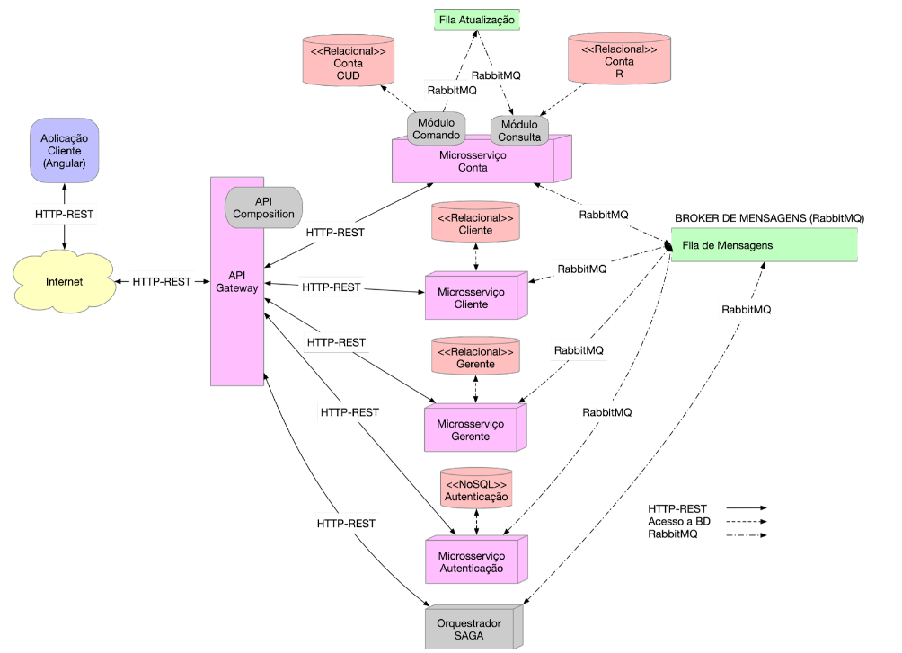

# DAC-BANTADS
Disciplina: Desenvolvimento de Aplicações Corporativas(DAC). 
Orientação: Prof. Dr. Razer A N R Montaño.   
O objetivo deste trabalho é o desenvolvimento de um sistema de Internet Banking usando Angular e Java Spring, baseado na arquitetura de microsserviços.  
A arquitetura do sistema será desenvolvida com base no seguinte diagrama:

 <h2>Fase 1 - 20%:</h2>
 
  - [ ] Entrega fase 1: Até 07/05/2023.
  - [ ] Apresentação: 08/05/2023 19:00. 
    * Apresentação em sala, nem todos precisam estar presentes. 
    * Deve-se abrir o software executando e apresentar o código. 
    
 <h2>Fase 2 - 80%:</h2>
 
  - [ ] Entrega fase 2: Até 22/06/2023.
  - [ ] Defesas 26/06/2023 ou 27/06/2023.
    
  Defesa do trabalho, critérios a serem definidos pelo professor.

  <h3>Deve ser entregue em arquivo ZIP:</h3>
  
  - [ ] Todos os fontes do projeto;
  - [ ] Scripts de inicialização do banco de dados (criação e inserções);
  - [ ] Scripts para construção das imagens e execução do projeto;
  - [ ] Link para UM vídeo no Youtube onde são mostrados os requisitos funcionais.
  - [ ] Cuidado para remover arquivos inúteis (executáveis, bibliotecas, diretório node_modules) antes da compactação.
  
  <h3>Requisitos Mínimos para Entrega e Defesa</h3>
  
  - [ ] Sistemas usando arquitetura de microsserviços;
  - [ ] Frontend acessando o API Gateway via HTTP-REST;
  - [ ] Login e Cadastros básicos funcionando de forma completa;
  - [ ] Uma SAGA completamente implementada;
  - [ ] Uso do RabbitMQ;
  - [ ] Sistemas devem possuir interface muito bem elaborada. (Não será permitida a entrega de sistemas em HTML puro ou com interface ruim);

  <h3>Requisitos Funcionais : 30%</h3>
  
   - [ ] Vídeo contendo a apresentação de todos os requisitos funcionais implementados.
   - [ ] No vídeo deve aparecer - de forma clara - a identificação do requisito (Número e nome, conforme a especificação do trabalho) que está sendo testado e o teste efetivo de todos os aspectos do requisito.
   - [ ] O vídeo deve ter, no máximo, 20 minutos de duração.
  * Não há necessidade de todos os integrantes da equipe participarem do vídeo.
  
  <h3>Avaliação dos requisitos funcionais implementados:</h3>
  <h4>Cliente:</h4>
  
  - [ ] R1   - Autocadastro
  - [ ] R2   - Login/Logout.
  - [ ] R3   - Tela inicial cliente.
  - [ ] R4   - Alteração de perfil.
  - [ ] R5   - Depositar.
  - [ ] R6   - Saque.<
  - [ ] R7   - Transferência.
  - [ ] R8   - Consulta de extrato.
  
  <h4>Gerente:</h4>
  
  - [ ] R9   - Tela inicial gerente.
  - [ ] R10  - Aprovar cliente.
  - [ ] R11  - Rejeitar cliente.
  - [ ] R12  - Consultar todos os clientes.
  - [ ] R13  - Consultar cliente.
  - [ ] R14  - Consultar 5 melhores clientes.

  <h4>Admin:</h4>
  
  - [ ] R15  - Tela inicial.
  - [ ] R16  - Relatório de clientes.
  - [ ] R17  - Inserção de gerente.
  - [ ] R18  - Remoção de gerente.
  - [ ] R19  - Listagem de gerentes.
  - [ ] R20  - Alteração de gerente.

<h3>Defesa Não Funcionais: 50%</h3>

  - [ ] Defesa dos requisitos não-funcionais. O sistema deve estar funcionando, todos os contêineres carregados.

  - [ ] Todos os fontes devem estar disponibilizados, bem como banco de dados e scripts.
 
  * A nota será individual, por aluno, que deverá responder aos questionamentos do professor, bem como demonstrar fluência no código para explicá-lo, alterá-lo ou criar funcionalidades novas, no momento da defesa.
  
  <h3>Avaliação dos requisitos não-funcionais não implementados(Desconto na nota):</h3>
  
  - [ ] NF1  - Não usou Angular.  -= 100<
  - [ ] NF2  - Não usou Bootstrap nem Material. -= 50
  - [ ] NF3  - Não separou a aplicação em módulos. -= 20
  - [ ] NF4  - Não usou serviço de guarda. -= 20
  - [ ] NF5  - Não usou módulo compartilhado(SharedModule). -= 20
  - [ ] NF6  - Não usou Pipes. -= 10
  - [ ] NF7  - Não usou diretivas. -= 10
  - [ ] NF8  - Não usou services(para acesso aos dados) - por componente. -= 10
  - [ ] NF9  - Campo sem validação(por campo). -= 5
  - [ ] NF10 - Datas no formato não brasileiro(por ocorrência). -= 1
  - [ ] NF11 - Campo sem máscara(por campo). -= 1
  - [ ] NF12 - TypeScript: nomeação de classes, atributos e métodos fora do padrão(por ocorrência). -= 1

  

  <h3>Sprints : 20%</h3>
  
  * Apresentação da sprint review em sala, em toda aula.
  * A nota será dada pela participação na sprint review e pelas atividades desempenhadas.
  * Não será dada nota para alunos que "ajudaram", ou "ficaram junto", ou "deram apoio". Alunos devem desenvolver artefatos no projeto e isso será pontuado.

  <h3>FRONT-END</h3>
  
  <h3>Estrutura:</h3>
  
  * Repositório
    - [x] ~~Criação do repositório no GITHUB.~~ 
  
  * Módulos
    - [ ] Autenticação. 
    - [ ] Cliente. 
    - [ ] Conta. 
    - [ ] Gerente. 
    - [ ] Shared. 
  
  * Elementos
    - [ ] Diretivas. 
    - [ ] Pipes. 
  
  * Modelos
    - [ ] Cliente. 
    - [ ] Conta. 
    - [ ] Gerente. 
    - [ ] Login. 
    - [ ] Usuário. 
    - [ ] Outros Modelos. 

  <h3>Cliente</h3>
  
  * R0 - Autocadastro.
    - [ ] Template HTML(.html).
    - [ ] Componente(.ts).
    - [ ] Serviço.

  * R1 - Login/Logout.
    - [ ] Template HTML(.html).
    - [ ] Componente(.ts).
    - [ ] Serviço.

  * R2 - Tela inicial cliente
    - [ ] Template HTML(.html).
    - [ ] Componente(.ts).
    - [ ] Serviço.

  * R3 - Alteração de perfil.
    - [ ] Template HTML(.html).
    - [ ] Componente(.ts).
    - [ ] Serviço.

  * R4 - Depositar.
    - [ ] Template HTML(.html).
    - [ ] Componente(.ts).
    - [ ] Serviço.

  * R5 - Saque.
    - [ ] Template HTML(.html).
    - [ ] Componente(.ts).
    - [ ] Serviço.

  * R6 - Transferência.
    - [ ] Template HTML(.html).
    - [ ] Componente(.ts).
    - [ ] Serviço.

  * R7 - Consulta saldo atual.
    - [ ] Template HTML(.html).
    - [ ] Componente(.ts).
    - [ ] Serviço.

  * R8 - Consulta de extrato.
    - [ ] Template HTML(.html).
    - [ ] Componente(.ts).
    - [ ] Serviço.

  <h3>Gerente</h3>
  
  * R9 - Tela inicial Gerente.
    - [ ] Template HTML(.html).
    - [ ] Componente(.ts).
    - [ ] Serviço.

  * R10 - Aprovar cliente.
    - [ ] Template HTML(.html).
    - [ ] Componente(.ts).
    - [ ] Serviço.

  * R11 - Rejeitar cliente.
    - [ ] Template HTML(.html).
    - [ ] Componente(.ts).
    - [ ] Serviço.
  
  * R12 - Consultar todos os clientes.
    - [ ] Template HTML(.html).
    - [ ] Componente(.ts).
    - [ ] Serviço.

  * R13 - Consultar cliente.
    - [ ] Template HTML(.html).
    - [ ] Componente(.ts).
    - [ ] Serviço.

  * R14 - Consultar 5 melhores clientes.
    - [ ] Template HTML(.html).
    - [ ] Componente(.ts).
    - [ ] Serviço.

  <h3>Admin</h3>
  
  * R15 - Tela inicial.
    - [ ] Template HTML(.html).
    - [ ] Componente(.ts).
    - [ ] Serviço.

  * R16 - Relatório de clientes.
    - [ ] Template HTML(.html).
    - [ ] Componente(.ts).
    - [ ] Serviço.

  * R17 - Inserção de gerente.
    - [ ] Template HTML(.html).
    - [ ] Componente(.ts).
    - [ ] Serviço.

  * R18 - Remoção de gerente.
    - [ ] Template HTML(.html).
    - [ ] Componente(.ts).
    - [ ] Serviço.

  * R19 - Listagem de gerentes.
    - [ ] Template HTML(.html).
    - [ ] Componente(.ts).
    - [ ] Serviço.

  * R20 - Alteração de gerente.
    - [ ] Template HTML(.html).
    - [ ] Componente(.ts).
    - [ ] Serviço.

<h3>BACKEND</H3>

  * Repositório.
    - [x] ~~Criação do repositório GITHUB~~

  * Scripts.
    - [ ] Build do API Gateway.
    - [ ] Build do MS Conta.
    - [ ] Build do MS Gerente.
    - [ ] Build do MS Cliente.
    - [ ] Build do MS Autenticação.
    - [ ] Build do Orquestrador.
    - [ ] Geração Imagem API Gateway.
    - [ ] Geração Imagem MS Conta.
    - [ ] Geração Imagem MS Gerente.
    - [ ] Geração Imagem MS Cliente.
    - [ ] Geração Imagem MS Autenticação.
    - [ ] Geração Imagem Orquestrador.
    - [ ] Geração Imagem BD Conta - CUD.
    - [ ] Geração Imagem BD Conta - R.
    - [ ] Geração Imagem BD Gerente.
    - [ ] Geração Imagem BD Cliente.
    - [ ] Geração Imagem BD Autenticação.
    - [ ] Executar Aplicação.

  * API GATEWAY
    - [ ] Controller REST(app).
    - [ ] Manipulação do token JWT.
    - [ ] Invocação MS Conta.
    - [ ] Invocação MS Gerente.
    - [ ] Invocação MS Cliente.
    - [ ] Invocação MS Autenticação.
    - [ ] Invocação SAGA.
    - [ ] API Gateway.

  * MS CONTA
    - [ ] Modelagem BD - CORS CUD.
    - [ ] Modelagem BD - CQRS R.
    - [ ] Criação BD - CQRS CUD.
    - [ ] Criação BD - CQRS R.
    - [ ] Criação Entidades CUD.
    - [ ] Criação Entidades R.
    - [ ] Repositório CUD.
    - [ ] Repositório R.
    - [ ] DTOs
    - [ ] RabbitMQ - Producer CUD.
    - [ ] RabbitMQ - Consumer R.
    - [ ] Controller CQRS - Módulo Comando.
    - [ ] Controller CQRS - Módulo Leitura.

  * MS GERENTE
    - [ ] Modelagem BD.
    - [ ] Criação do BD.
    - [ ] Repositório.
    - [ ] DTOs.
    - [ ] RabbitMQ - Producer.
    - [ ] RabbitMQ - Consumer.
    - [ ] Controller REST.

  * MS CLIENTE
    - [ ] Modelagem BD.
    - [ ] Criação do BD.
    - [ ] Repositório.
    - [ ] DTOs.
    - [ ] RabbitMQ - Producer.
    - [ ] RabbitMQ - Consumer.
    - [ ] Controller REST.

  * MS AUTENTICAÇÃO
    - [ ] Modelagem BD.
    - [ ] Criação do BD.
    - [ ] Repositório.
    - [ ] DTOs.
    - [ ] RabbitMQ - Producer.
    - [ ] RabbitMQ - Consumer.
    - [ ] Controller REST.

  * SAGA ORQUESTRADA
    - [ ] DTOs.
    - [ ] RabbitMQ - Producer Cliente.
    - [ ] RabbitMQ - Consumer Cliente.
    - [ ] RabbitMQ - Producer Conta.
    - [ ] RabbitMQ - Consumer Conta.
    - [ ] RabbitMQ - Producer Gerente.
    - [ ] RabbitMQ - Consumer Gerente.
    - [ ] RabbitMQ - Producer Autenticação.
    - [ ] RabbitMQ - Consumer Autenticação.
    - [ ] Controller - SAGA Autocadastro.
    - [ ] Controller - SAGA Alteração de Perfil.
    - [ ] Controller - SAGA Remoção de Gerente.
    - [ ] Controller - SAGA Inserção de Gerente.
    - [ ] Controller - Outras SAGAS.
    

  
